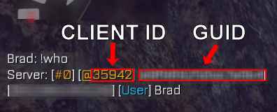
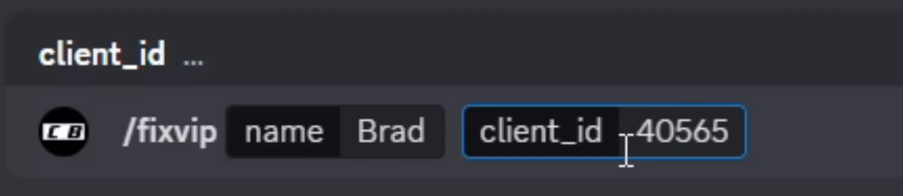
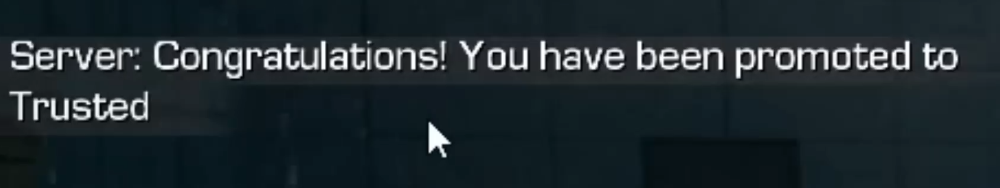

### Prerequisites
- Be in a Trickshot Server for the desired game.
- Be in the [Celebrity & Brad Trickshotting](/discord) Discord Server with the VIP role.
- Have a brain.

---

### Written Guide
1. **Join any of our trickshotting servers on any game.**

    Join the server for the game you want your VIP fixed on. For example, if you want your VIP fixed on H2M-Mod, join one of our H2M-Mod servers.

2. **Use the `!who` command in game chat**
    - Type `!who` **in game chat (NOT IN DISCORD)** and hit enter.
    - You should get a message from the server that includes your **Client ID.** It's the 5 digit number following the @ symbol.
    

3. **Use the `/fixvip` command in the Discord**
    - Go to the [**#fix-vip**](https://discord.com/channels/841528688721788938/1239339407664877599) channel in our [Discord Server](/discord).
    - Type `/fixvip` and enter your **in-game name** and **Client ID** in the `name` and `client_id` fields.
    - Hit enter.
    
    NOTE: YOU MUST BE IN A TRICKSHOT SERVER WHILE USING THIS COMMAND!

4. **Done! Your VIP commands should start working by next map rotation.**
    

### Video Guide

<video width="100%" controls>
  <source src="assets/vip fix video.mp4" type="video/mp4">
  Your browser does not support the video tag.
</video>


---

If you need more help or support, please join our [discord](/discord).